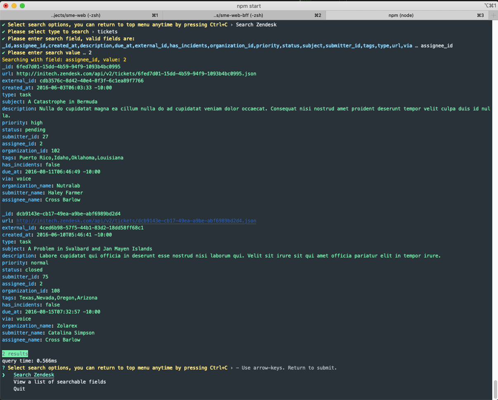
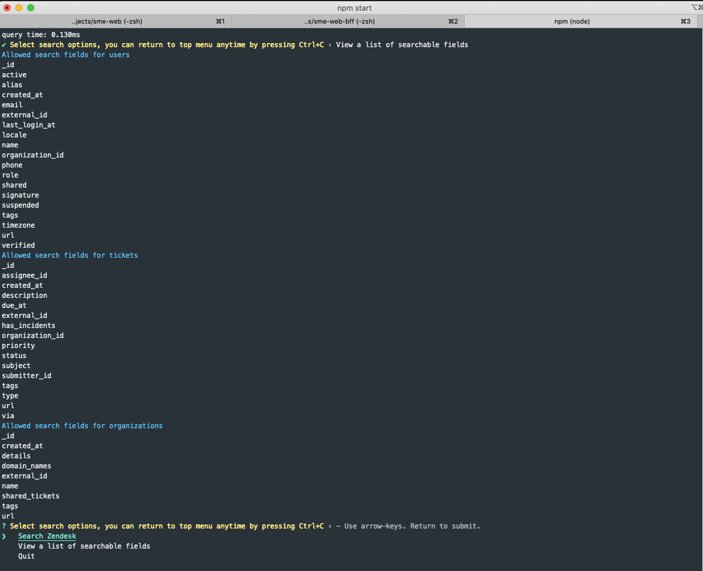

# Zendesk Melbourne - Coding Challenge

- [Running the application](#running-the-application)
- [Running tests](#running-tests)
- [Assumptions](#assumptions)
- [Gotchas](#gotchas)
- [Limitations and Improvements](#limitations-and-improvements)

## Running the application

1. Clone the project into your local first.
```
> git clone https://github.com/max-chen2/zen-chalenge.git max-zendesk && cd max-zendesk
```
2. Install node packages
```
> npm install
```
3. Run the application! Select `Search Zendesk` to start searching (if you wish to go back to the main menu, press `CTRL+C` at anytime).
```
> npm start
```
4. Select `Quit` and press `Enter` to exit

## Running tests

1. Complete step 1-3 in [Running the application](#running)
2. Run tests
```
> npm test
```

## Assumptions
- Fields for each entity type change over time, objects in array may not contain all fields and can be of different shape.
- Json data files do not change during run time, if json files do change, a manual restart will performed.
- Modules of this program should be designed in a way that individual teams can work on in silos, by using an agreed `init()` interface for each module. 
- Users and organizations have unique ids, so when there is a match on the associated entity, it only takes the first match.
- The search engine should be used as a general purpose search application, hence, knowledge of relationships between given entities in this exercise should be kept minimal.

## Gotchas
_(what i have learnt by doing this challenge)_
- When indexing fields by value, initial attempt was to default to `''` when value is `falsy`, however that made the 0 and false only searchable by searching `''` instead of `'0'` or `'false'`

## Limitations and improvements
1. Search on all data types are string based (e.g. searching on date requires the exact date string queries, searching on array requires the all elements of the string to be provided and separated by comma).
2. All indexes are kept in memory, in production code, i would leverage external persistance to help maintain the index, which, also allows the application to scale.
3. Data files are fully loaded and processed on startup, in production code - where the data is more likely to be from a database, the index can be built gradually with lazy loaded data.
4. Abstract `console.log` and `prompts`, modules should then be provided a console object to write to.

## Screenshots

### Search


### List fields
